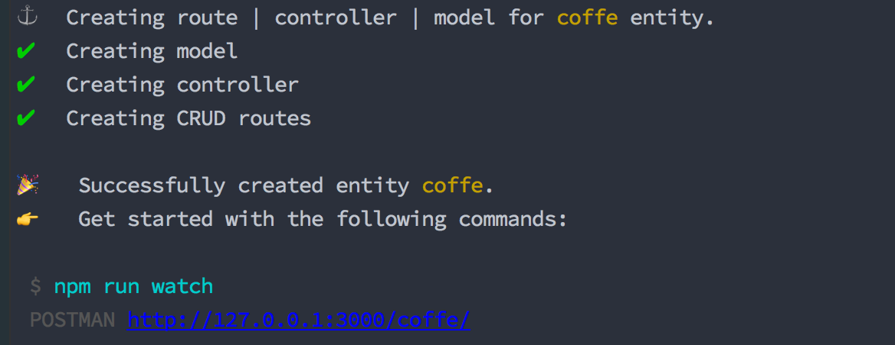

# tse-cli
## CLI for scaffolding [tse](https://github.com/tsejs/tse) boilerplate

- Init project from default template
``` sh
npm install -g tse-cli
```

## Init tse project
```sh
    tse init my-project
```

## Generate a new entity
```sh
    tse make coffe <- coffe here is the entity name
```

- Entity will contains:
 1. Schema definition with created_date timestamp
 ```typescript
import * as mongoose from 'mongoose';

const Schema = mongoose.Schema;

export const CoffeSchema = new Schema({
    created_date: {
        type: Date,
        default: Date.now
    }
});

```
 2. CRUD routes 
 ```typescript
import coffeController from '../controllers/CoffeController';
import {router} from '../lib/Facades';
router.group({
    prefix: 'coffe',
    middleware: []
}, router => {
    router.post('', coffeController.store);
    router.get(':coffeId', coffeController.getCoffeWithID);
    router.get('', coffeController.getCoffes);
    router.post('', coffeController.store);
    router.put(':coffeId', coffeController.updateCoffe);
    router.delete(':coffeId', coffeController.deleteCoffe);
});
```
 3. Controller that support base CRUD
 ```typescript
import * as mongoose from 'mongoose';
import { Controller } from './Controller';
import { CoffeSchema } from '../models/CoffeSchema';
import { Request, Response } from '../lib/framework/application/http';
const Coffe = mongoose.model('Coffe', CoffeSchema);
export class CoffeController extends Controller {
    public getCoffes (req: Request, res: Response) {
        Coffe.find({}, (err, entity) => {
            if (err) {
                res.send(err);
            }
            res.respond(entity);
        });
    }

    public store(req: Request, res: Response) {
        Coffe.create(req.body, (err, entity) => {
            if (err) {
                res.send(err);
            }
            res.respond(entity);
        });
    }

    public getCoffeWithID (req: Request, res: Response) {
        Coffe.findById(req.params.coffeId, (err, entity) => {
            if (err) {
                res.send(err);
            }
            res.respond(entity);
        });
    }

    public updateCoffe (req: Request, res: Response) {
        Coffe.findOneAndUpdate({ _id: req.params.coffeId }, req.body, { new: true }, (err, entity) => {
            if (err) {
                res.send(err);
            }
            res.respond(entity);
        });
    }

    public deleteCoffe (req: Request, res: Response) {
        Coffe.remove({ _id: req.params.coffeId }, (err, entity) => {
            if (err) {
                res.send(err);
            }
            res.respond({ message: 'Successfully deleted Coffe!'});
        });
    }
}

export default new CoffeController();

```


## Stay In Touch

- [Twitter](https://twitter.com/LupacescuEuard)

## License

[MIT](http://opensource.org/licenses/MIT)

Copyright (c) 2018-present, Binaryk (Eduard) Lupacescu


